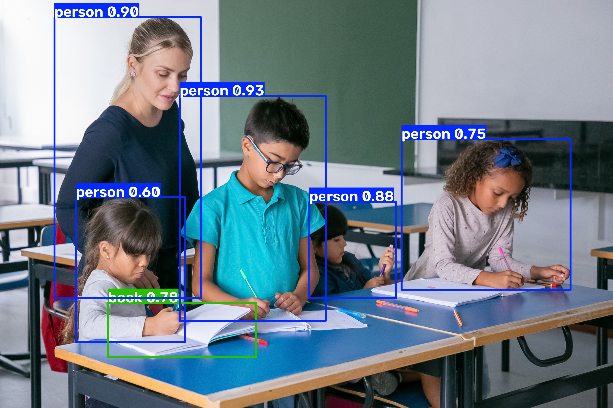

# YOLO Object Detection Project

## Overview
This project implements object detection using YOLOv8 with Python and OpenCV.

The model detects objects from images and displays:
- Detected object names
- Confidence scores
- Bounding boxes around detected objects

## Technologies Used

- Python
- YOLOv8
- Ultralytics
- OpenCV
- NumPy

## Features

- Image-based object detection
- Multiple object detection
- Bounding box visualization
- Confidence score calculation


## Output

Example detection result:



## Installation

Clone this repository:

```bash
git clone https://github.com/kaju-katli0/Object_Detection.git
